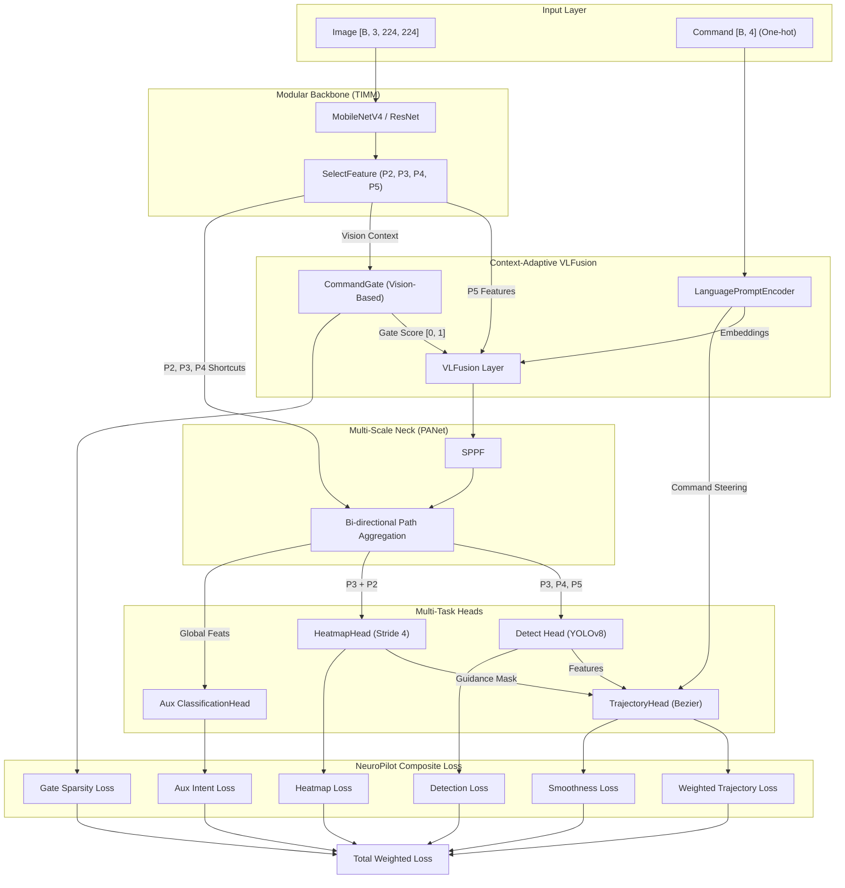

# Methodology: NeuroPilot Architecture for Robust Autonomous Driving

This section details the proposed **NeuroPilot** architecture, an end-to-end framework that integrates Vision-Language fusion with a multi-task learning objective to achieve robust navigation under diverse environmental contexts.

## 1. Problem Formulation
Given an input image triplet $I \in \mathbb{R}^{B \times 3 \times H \times W}$ and a discrete navigational command $c \in \{0, \dots, N_{cmd}-1\}$, the NeuroPilot model aims to predict:
1.  A set of optimal future waypoints $W = \{w_1, w_2, \dots, w_{N_w}\}$ where $w_i \in \mathbb{R}^2$.
2.  A semantic heatmap $H \in [0, 1]^{B \times 1 \times 56 \times 56}$ representing the drivable midline.
3.  A set of standard YOLO detection boxes $B$ and classes $Cls$.
4.  An auxiliary intent classification $\hat{y}$ to verify visual grounding.

## 2. Global Architecture Overview

## 3. Architecture Components and Mathematical Formalization

### 3.1 Adaptive Vision-Language Fusion
The fusion of visual features $F_v$ from the backbone and language embeddings $E$ (from `LanguagePromptEncoder`) is governed by a **CommandGate** $G$, which mitigates the impact of temporally noisy or "early" commands.

**Command Gating:**
The relevance score $G$ is predicted strictly from visual context:
$$G = \sigma(\text{MLP}(\text{GAP}(F_v))) \in [0, 1]$$
where $\text{GAP}$ is Global Average Pooling and $\sigma$ is the Sigmoid activation.

**Gated Cross-Attention:**
The final fused feature $F_f$ is calculated as:
$$F_f = F_v + G \cdot \text{MultiHeadAttn}(F_v, E, E)$$
When $G \rightarrow 0$ (e.g., straight road), the model relies entirely on vision. When $G \rightarrow 1$ (e.g., approaching an intersection), the model "unlocks" the navigational command.

### 3.2 Multi-Scale Integration (Neck)
The Neck follows a PANet structure with **Skip-Connections** from low-level backbone features (P2, P3).
The **HeatmapHead** specifically consumes the fusion of P3 and P2 to produce a sharp, **Stride-4 (56x56)** mask representing the safe drivable surface.

## 4. Optimization: Multi-Task Composite Loss
We optimize the model using a multi-component objective function:
$$\mathcal{L}_{total} = \lambda_{det}\mathcal{L}_{det} + \lambda_{traj}\mathcal{L}_{traj} + \lambda_{hm}\mathcal{L}_{hm} + \lambda_{gate}\mathcal{L}_{gate} + \lambda_{aux}\mathcal{L}_{aux} + \lambda_{smooth}\mathcal{L}_{smooth}$$

### 4.1 Trajectory Loss with "Martial Law"
To ensure robustness during critical turns, we employ a curvature-weighted MSE loss:
$$\mathcal{L}_{traj} = \frac{1}{B} \sum_{b=1}^B \kappa_b \cdot \|W_{pred}^b - W_{gt}^b\|^2$$
where $\kappa_b = 5.0$ if the ground truth curvature exceeds a threshold $\tau$, ensuring high-energy supervision for rare maneuvers.

### 4.2 Information Bottleneck Regularization (Gate Sparsity)
To force the model to learn autonomous features from vision alone, we apply a sparsity penalty to the gate score:
$$\mathcal{L}_{gate} = \frac{1}{B} \sum_{b=1}^B \text{Mean}(G^b)$$
This teaches the model to only use the external "Command" command when visual signals are ambiguous.

### 4.3 Auxiliary Intent Supervision
The **Auxiliary Classification Head** predicts the intent $\hat{y}$ from the hidden backbone state to achieve **Visual Grounding**:
$$\mathcal{L}_{aux} = \text{CrossEntropy}(\hat{y}, y_{target})$$
By proving the model can "see" the command's context in the image, we ensure the trajectory is not predicted by blind correlation.

## 5. Technical Advantages
- **LEGO-Style Modularity**: Supports swapping any TIMM-compatible backbone.
- **Interpretable Fusion**: The `gate_score` provides a real-time metric of how much the model "trusts" the user's command vs. its own visual perception.
- **Geometric Precision**: Heatmap-guided plan generation ensures lane-level accuracy.
